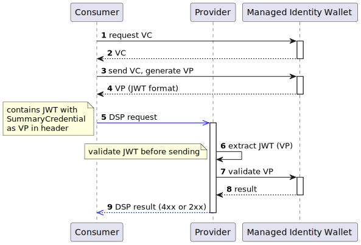

# Introduction

The implementation for supporting the _Identity Next_ milestone consists of three work streams:

1. Incremental changes to core EDC to support requirements associated with adding verifiable presentations to outgoing
   requests.
2. An implementation of `IdentityService` extension point that will be hosted in the Tractus-X EDC repository as its
   requirements are specific to the Catena-X dataspace.
3. A set of policy functions for handling outbound and inbound verifiable presentations.

# Requirements

The following are technical requirements that the implementation will adhere to:

1. All verifiable presentations will be processed as native Json-Ld using
   the [Titanium library](https://github.com/filip26/titanium-json-ld). The EDC has chosen Titanium as its Json-Ld
   library and Tractus-X EDC will align with that.
2. Verifiable presentations will be validated in process using Titanium's sibling
   library, [Iron](https://github.com/filip26/iron-verifiable-credentials). There is no need to introduce the complexity
   and performance overhead of additional libraries or out-of-process calls.
3. Policy functions will operate on verifiable presentations as Json-P structures. These structures will be in Json-Ld
   expanded form, which will be computed by EDC services transparently on request ingress.

# Usage Policies and Verifiable Presentations

DSP usage policy (ODRL) will be employed to advertise which verifiable presentations are required. For example, a usage
policy could be:

```json
{
  "@context": {
    "cx": "https://w3id.org/cx/v0.8/",
    "@vocab": "http://www.w3.org/ns/odrl.jsonld"
  },
  "@type": "Offer",
  "@id": "a343fcbf-99fc-4ce8-8e9b-148c97605aab",
  "permission": [
    {
      "action": "use",
      "constraint": {
        "leftOperand": "cx:CX_DismantlerCredential.allowedVehicleBrand",
        "operator": "eq",
        "rightOperand": "Brand A"
      }
    }
  ]
}
```

or

```json
{
  "@context": {
    "cx": "https://w3id.org/cx/v0.8/",
    "@vocab": "http://www.w3.org/ns/odrl.jsonld"
  },
  "@type": "Offer",
  "@id": "a343fcbf-99fc-4ce8-8e9b-148c97605aab",
  "permission": [
    {
      "action": "use",
      "constraint": {
        "leftOperand": "cx:CX_DismantlerCredential.activityType",
        "operator": "eq",
        "rightOperand": "vehicleDismantle"
      }
    }
  ]
}
```

The presence of the `cx:CX_DismantlerCredential` in the left operand will inform the client to include a verifiable
presentation in contract negotiation and data transfer requests.

# EDC Incremental Changes

The EDC will introduce a two new policy scopes, `contract.negotiation.request` and `transfer.process.request` that will
be evaluated by `DspHttpRemoteMessageDispatcherImpl`. During evaluation, policy functions may update
the `TokenParameters.Builder` obtained from the `PolicyContext` (`TokenParameters` will be modified to take arbitrary
properties). These properties can then be used by the `IdentityService` implementation to request verifiable
presentations.

The EDC DSP policy deserializers will also be enhanced to support demarshalling verifiable presentations serialized as
Json-Ld into a `LiteralExpression` that contains a Json-P structure.

# Tractus-X `IdentityService` Implementation

A custom implementation of the `IdentityService` will be created that can obtain verifiable presentations based
on `TokenParmeters` and create a self-issued authentication token to include in the outgoing request header.
The `IdentityService` implementation should support an extensible VP request processor based on the EDC registry
pattern.

The implementation will also support verifying incoming VPs and adding their deserialized Json-Ld structures into the
return `ClaimToken`. Policy evaluation (see next section) will then operate on the deserialized `ClaimToken` and can
assume all VPs are valid. VP validation will be done by the **Iron library**.

# Tractus-X Policy Functions

Tractus-X will include a policy function for each VC type. The function will implement a simple policy expression that
will be defined for each verifiable credential type. The policy function will evaluate the expression against the Json-P
VC structure when the `contract.negotiation` and `transfer.process` scopes are engaged.

**Note** that we will not implement a generic VC expression language (e.g. JSONPath) as it does not promote
interoperability, would be difficult for business analysts to author and read, and is cumbersome to use with Json-Ld
prefixes (i.e. the JSONPath expressions would have to specify properties in expanded form).   

# Basic message flow
This diagram shows the proposed message sequence at a coarse level. Please note that this 
is only scoped for the 3.2 Release of Tractus-X and is subject to change. It uses the [SummaryCredential](../../../credentials/summary/summary.vc.md), which is a temporary solution.

The JWT must be generated according to [this definition](./identity.next.md#51-self-issued-token-format) upon every request. 
The Provider should validate the token format _before_ contacting the MiW.

